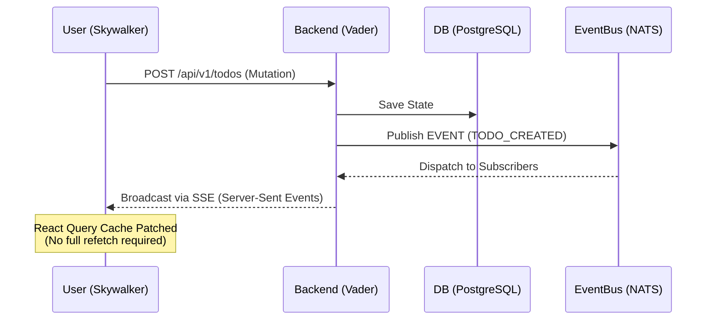

# Death Star Monorepo

## 🌌 Introduction

Death Star is a high-performance microservices reference architecture designed for real-time state synchronization and efficient I/O handling. It demonstrates a modern full-stack implementation featuring a Java-based backend and a React-based frontend, synchronized via event-driven communication.

## 🏗 Architecture Flow

The following diagram illustrates the event-driven data flow leveraging NATS and Server-Sent Events (SSE) for zero-latency UI updates.




## Core Tech Stack

- Backend: Java 23, Spring Boot (WebMVC with Virtual Threads), JPA, PostgreSQL.

- Messaging: NATS for inter-service events and SSE (Server-Sent Events) for real-time UI updates.

- Frontend: React, Vite, TanStack Query (Cache Patching), Tailwind CSS.

- Contract & Tooling: OpenAPI (Contract-First), Just (Command Runner), Turborepo, Gradle.

## Project Structure

```plain
│
├── .github/                   # CI/CD workflows and automation
├── holocron/                  # [Contract Center] API specs and runtime type guards
│   ├── openapi.yaml           # Single Source of Truth for API & Events
│   ├── package.json           # Scripts for openapi-typescript generation
│   ├── tsconfig.json          # TypeScript compilation context (noEmit)
│   └── src/
│       ├── index.ts           # Unified module entry point (types + guards)
│       ├── utils/             # Runtime validation logic and constants
│       └── generated/         # Auto-generated API types (gitignored)
│
├── vader/                     # [Backend] Java 23 / Spring WebMVC
│   ├── build.gradle           # Backend build and dependency management
│   └── src/main/
│       ├── java/.../          # Controllers, Services (NATS/SSE), Repositories
│       └── resources/
│           ├── application*.yml # Configuration profiles (Dev, Prod, E2E)
│           └── db/migration/    # Flyway SQL schema migrations
│
├── skywalker/                 # [Frontend] Vite + React Main App
│   ├── vite.config.ts         # Backend proxy and esbuild targets
│   ├── tailwind.config.js     # Tailwind configuration (inherits millennium)
│   └── src/
│       ├── api/client.ts      # Typesafe API client using holocron types
│       ├── hooks/             # SSE integration and cache patching hooks
│       ├── App.tsx            # Main UI Orchestration Component
│       └── main.tsx           # React entry point with QueryClient setup
│
├── millennium/                # [UI Library] Shared design system and components
│   ├── tailwind.config.js     # Shared Tailwind presets and design tokens
│   └── src/
│       ├── components/ui/     # Atomic UI components (Button, Card, etc.)
│       ├── styles/            # Design tokens (Global CSS variables)
│       ├── lib/utils.ts       # Utility functions (Tailwind Merge, cn)
│       └── index.ts           # Public UI exports
│
├── .gitignore                 # Global exclusion rules
├── biome.json                 # Global linter and formatter configuration
├── build.gradle               # Root Gradle project (Spotless configuration)
├── settings.gradle            # Gradle multi-project registry
├── package.json               # Monorepo workspaces and global dev-tools
├── turbo.json                 # Task dependency orchestration and caching
├── justfile                   # Unified development command center
└── docker-compose.yml         # Local infrastructure (PostgreSQL & NATS)

```

## 📋 Prerequisites

Before initializing the project, ensure your local development environment meets the following strictly enforced baseline requirements:

- Java 23: Required for Virtual Threads support. (Recommend SDKMAN)

- Node.js 22+ & npm 10+: Required for modern frontend tooling. (Recommend fnm or nvm)

- Docker Engine: Required for local infrastructure and E2E testing.

- Just: The command runner used for orchestration. `brew install just`

- (Optional) Hurl: Used for declarative E2E API testing. `brew install hurl`

## 🚀 Getting Started

1. Initialize Environment

Run this once after cloning the repository to set up the Gradle wrapper, install dependencies, and generate API types:

``` bash
just init
```

2. Start Infrastructure & Dependencies

Spin up Docker containers (PostgreSQL, NATS) and sync API contracts:

``` bash
just dev-deps
```

3. Run Development Servers

For the best experience, run these commands in separate terminals:

- Terminal A (Backend):
```bash
just dev-vader
```

- Terminal B (Frontend):

```bash
just dev-skywalker
```

4. Cleanup

If you encounter port conflicts, use this command to shutdown infrastructure and kill hanging processes:

```bash
just stop
```

## Holocron

Holocron serves as the centralized API Contract Center and the single source of truth for the entire monorepo, managing the OpenAPI specification and providing runtime type guards to ensure strict type safety and eliminate integration drift between backend and frontend.

## Vader

Vader acts as the core Backend Service built on Java 23 and Spring WebMVC, utilizing Virtual Threads (Project Loom) to handle high-concurrency I/O efficiently while orchestrating data persistence and event broadcasting via NATS for real-time updates.

## Skywalker

Skywalker is the primary Frontend Application developed with React and Vite, featuring a highly reactive UI that achieves low-latency state synchronization by patching TanStack Query caches directly from Server-Sent Events (SSE) streams.

## Millennium

Millennium functions as the shared Design System and UI Library, providing atomic components and foundational Tailwind CSS tokens that ensure visual consistency and accelerate development across all frontend workspaces within the monorepo.