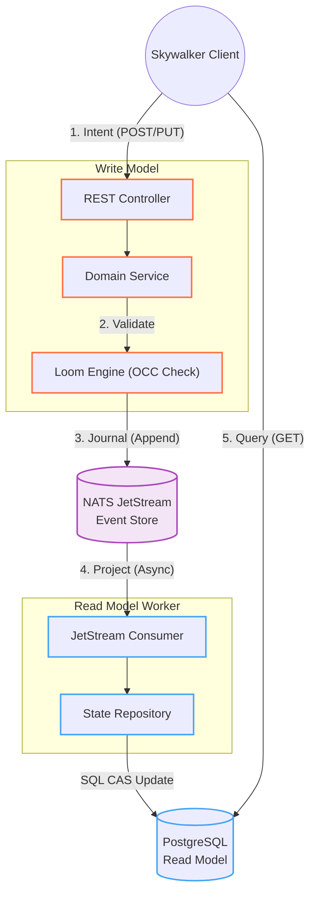

# Death Star Monorepo

## 🌌 Introduction

Death Star is a high-performance microservices reference architecture designed for real-time state synchronization and efficient I/O handling. It demonstrates a modern full-stack implementation featuring a Java-based backend and a React-based frontend, synchronized via event-driven communication.

## 🏗 Architecture Flow

Death Star uses a custom engine called **Loom** to manage data. Instead of saving data directly to the database, Loom records every change as a timeline of events using **Event Sourcing** and **CQRS (Command Query Responsibility Segregation)**, powered by NATS JetStream and PostgreSQL.

This gives us a perfect history of all changes and allows the system to be highly scalable. The data flows through 5 simple steps:

1. **Intent (User Action):** The user performs an action in the app (like updating a Task Title). The server translates this into an `Event` request.
2. **Validate (Check for Conflicts):** The `LoomEngine` checks if the user is editing the latest version of the data. If the user's screen is outdated, it blocks the change. Otherwise, it allows it.
3. **Journal (Save the Event):** The approved `Event` is permanently saved to the **NATS JetStream Event Store**. This append-only log is the system's absolute source of truth.
4. **Projection (Update the Database):** In the background, workers listen to the Event Store and continuously update the PostgreSQL database tables so they reflect the latest data.
5. **Query (Read the Data):** When the user loads a page, the app reads directly from the fast, updated PostgreSQL database without dealing with the complex Event Store.


```mermaid
flowchart TD
    Client((Skywalker Client))
    
    subgraph Command Side [Write Model]
        API[REST Controller]
        Domain[Domain Service]
        Loom["Loom Engine (OCC Check)"]
    end
    
    Ledger[(NATS JetStream<br/>Event Store)]
    
    subgraph Projection Side [Read Model Worker]
        Worker[JetStream Consumer]
        Repo[State Repository]
    end
    
    DB[(PostgreSQL<br/>Read Model)]
    
    Client -- 1. Intent (POST/PUT) --> API
    API --> Domain
    Domain -- 2. Validate --> Loom
    Loom -- 3. Journal (Append) --> Ledger
    
    Ledger -- 4. Project (Async) --> Worker
    Worker --> Repo
    Repo -- SQL CAS Update --> DB
    
    Client -- 5. Query (GET) --> DB
    
    classDef write stroke:#ff7043,stroke-width:2px;
    classDef read stroke:#42a5f5,stroke-width:2px;
    classDef store fill:#f3e5f5,stroke:#ab47bc,stroke-width:2px;
    
    class API,Domain,Loom write;
    class Worker,Repo,DB read;
    class Ledger store;
```

## Core Tech Stack

- Backend: Java 23, Spring Boot (WebMVC with Virtual Threads), JPA, PostgreSQL.

- Messaging: NATS with JetStream for durable inter-service events (like Audit Logs) and NATS Core for ephemeral real-time UI updates (Server-Sent Events).

- Frontend: React, Vite, TanStack Query (Cache Patching), Tailwind CSS.

- Contract & Tooling: OpenAPI (Contract-First), Just (Command Runner), Turborepo, Gradle.

## 🔀 API Routing Topology

The architecture uses an API Gateway pattern to safely decouple the frontend from the backend microservices. 

- **Frontend:** Makes simple request calls to semantic paths (e.g., `/api/v1`).
- **L7 Router (Gateway):** Intercepts these requests, dynamically routes them to the correct microservice, and strips the external prefix.
- **Backend:** Remains entirely unaware of the external network topology. It focuses purely on domain logic without hardcoded context paths.

This clean separation allows for highly scalable, zero-cost microservice decomposition in the future.

## 🔭 Observability Stack

The `death-star` monorepo implements an **"Observation First"** architecture, unifying Traces, Metrics, and Application Logs into a single, high-performance centralized backend:

- **OpenTelemetry (OTel)**: Serves as the universal standard for instrumenting the Gateway (Skywalker), the business logic (Vader), and the NATS event bus. Trace context is seamlessly propagated across HTTP and asynchronous messaging boundaries.
- **ClickHouse**: A hyper-fast, column-oriented OLAP database used to natively ingest and store all telemetry data. We utilize native Bloom Filter data skipping indices to guarantee instant `TraceId` point lookups without full-table scans.
- **Grafana**: Provides the single pane of glass to dashboard and query the ClickHouse observability data using standard SQL aggregations.

## Project Structure

```plain
│
├── .github/                   # CI/CD workflows and automation
├── holocron/                  # [Contract Center] API specs & TS types
├── vader/                     # [Backend] Java 23 / Spring WebMVC
├── skywalker/                 # [Frontend] Vite + React Main App
├── millennium/                # [UI Library] Shared design system
├── .gitignore                 # Global exclusion rules
├── biome.json                 # Global linter and formatter configuration
├── build.gradle               # Root Gradle project (Spotless configuration)
├── settings.gradle            # Gradle multi-project registry
├── package.json               # Monorepo workspaces and global dev-tools
├── turbo.json                 # Task dependency orchestration and caching
├── justfile                   # Unified development command center
└── docker-compose.yml         # Local infrastructure (PostgreSQL & NATS)
```

## 📋 Prerequisites

Before initializing the project, ensure your local development environment meets the following strictly enforced baseline requirements:

- Java 23: Required for Virtual Threads support. (Recommend SDKMAN)

- Node.js 22+ & npm 10+: Required for modern frontend tooling. (Recommend fnm or nvm)

- Docker Engine: Required for local infrastructure and E2E testing.

- Just: The command runner used for orchestration. `brew install just`

- (Optional) Hurl: Used for declarative E2E API testing. `brew install hurl`

## 🚀 Getting Started

1. Initialize Environment

Run this once after cloning the repository to set up the Gradle wrapper, install dependencies, and generate API types:

``` bash
just init
```

2. Start Infrastructure & Dependencies

Spin up Docker containers (PostgreSQL, NATS) and sync API contracts:

``` bash
just dev-deps
```

3. Run Development Servers

For the best experience, run these commands in separate terminals:

- Terminal A (Backend):
```bash
just dev-vader
```

- Terminal B (Frontend):

```bash
just dev-skywalker
```

4. Cleanup

If you encounter port conflicts, use this command to shutdown infrastructure and kill hanging processes:

```bash
just stop
```