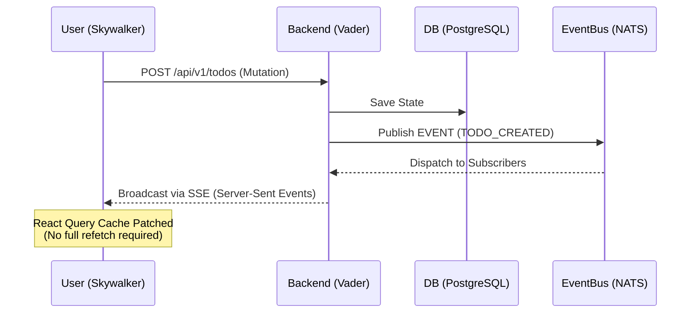

# Death Star Monorepo

## 🌌 Introduction

Death Star is a high-performance microservices reference architecture designed for real-time state synchronization and efficient I/O handling. It demonstrates a modern full-stack implementation featuring a Java-based backend and a React-based frontend, synchronized via event-driven communication.

## 🏗 Architecture Flow

The following diagram illustrates the event-driven data flow leveraging NATS and Server-Sent Events (SSE) for zero-latency UI updates.



```mermaid
sequenceDiagram
    participant User (Skywalker)
    participant Backend (Vader)
    participant DB (PostgreSQL)
    participant EventBus (NATS)

    User (Skywalker)->>Backend (Vader): POST /api/v1/todos (Mutation)
    Backend (Vader)->>DB (PostgreSQL): Save State
    Backend (Vader)->>EventBus (NATS): Publish EVENT (TODO_CREATED)
    EventBus (NATS)-->>Backend (Vader): Dispatch to Subscribers
    Backend (Vader)-->>User (Skywalker): Broadcast via SSE (Server-Sent Events)
    Note over User (Skywalker): React Query Cache Patched<br/>(No full refetch required)
```

## Core Tech Stack

- Backend: Java 23, Spring Boot (WebMVC with Virtual Threads), JPA, PostgreSQL.

- Messaging: NATS for inter-service events and SSE (Server-Sent Events) for real-time UI updates.

- Frontend: React, Vite, TanStack Query (Cache Patching), Tailwind CSS.

- Contract & Tooling: OpenAPI (Contract-First), Just (Command Runner), Turborepo, Gradle.

## 🔀 API Routing Topology

The architecture uses an API Gateway pattern to safely decouple the frontend from the backend microservices. 

- **Frontend:** Makes simple request calls to semantic paths (e.g., `/api/v1`).
- **L7 Router (Gateway):** Intercepts these requests, dynamically routes them to the correct microservice, and strips the external prefix.
- **Backend:** Remains entirely unaware of the external network topology. It focuses purely on domain logic without hardcoded context paths.

This clean separation allows for highly scalable, zero-cost microservice decomposition in the future.

## Project Structure

```plain
│
├── .github/                   # CI/CD workflows and automation
├── holocron/                  # [Contract Center] API specs & TS types
├── vader/                     # [Backend] Java 23 / Spring WebMVC
├── skywalker/                 # [Frontend] Vite + React Main App
├── millennium/                # [UI Library] Shared design system
├── .gitignore                 # Global exclusion rules
├── biome.json                 # Global linter and formatter configuration
├── build.gradle               # Root Gradle project (Spotless configuration)
├── settings.gradle            # Gradle multi-project registry
├── package.json               # Monorepo workspaces and global dev-tools
├── turbo.json                 # Task dependency orchestration and caching
├── justfile                   # Unified development command center
└── docker-compose.yml         # Local infrastructure (PostgreSQL & NATS)
```

## 📋 Prerequisites

Before initializing the project, ensure your local development environment meets the following strictly enforced baseline requirements:

- Java 23: Required for Virtual Threads support. (Recommend SDKMAN)

- Node.js 22+ & npm 10+: Required for modern frontend tooling. (Recommend fnm or nvm)

- Docker Engine: Required for local infrastructure and E2E testing.

- Just: The command runner used for orchestration. `brew install just`

- (Optional) Hurl: Used for declarative E2E API testing. `brew install hurl`

## 🚀 Getting Started

1. Initialize Environment

Run this once after cloning the repository to set up the Gradle wrapper, install dependencies, and generate API types:

``` bash
just init
```

2. Start Infrastructure & Dependencies

Spin up Docker containers (PostgreSQL, NATS) and sync API contracts:

``` bash
just dev-deps
```

3. Run Development Servers

For the best experience, run these commands in separate terminals:

- Terminal A (Backend):
```bash
just dev-vader
```

- Terminal B (Frontend):

```bash
just dev-skywalker
```

4. Cleanup

If you encounter port conflicts, use this command to shutdown infrastructure and kill hanging processes:

```bash
just stop
```